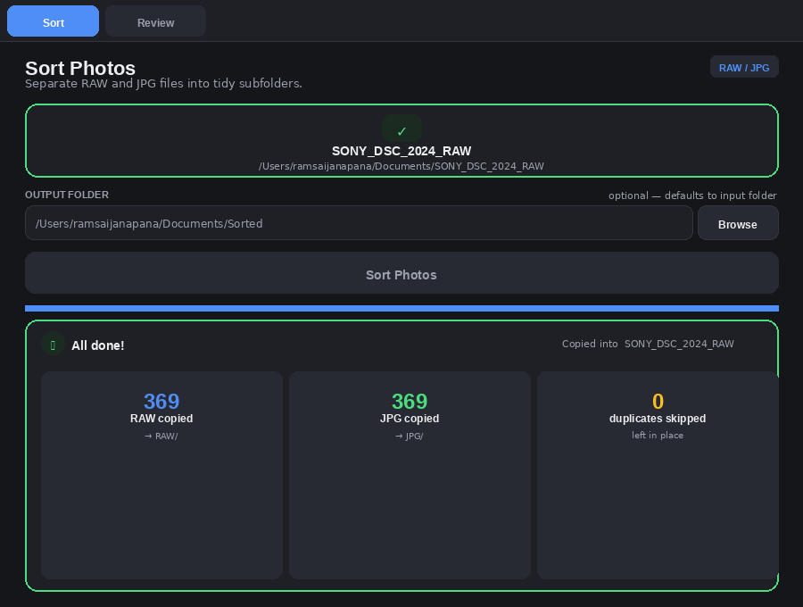
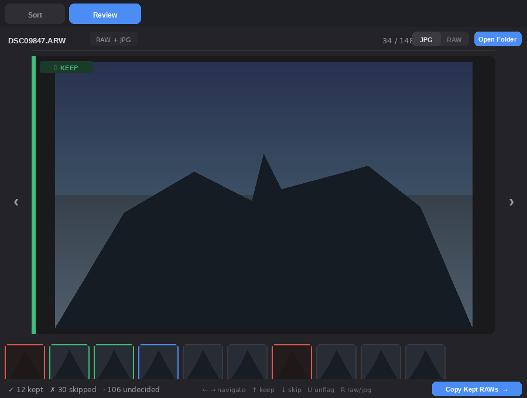

# Photo Sorter

A portable, no-prerequisites desktop app for photographers. Sort RAW and JPG files into tidy subfolders, then review and cull your shots before sending them to Lightroom — all without installing Python or any dependencies.

---

## Screenshots

### Sort Tab — Organize files with one click


### Review Tab — Cull photos before editing


---

## Features

**Sort Tab**
- Choose any folder containing RAW and JPG files
- Optionally specify a separate output folder (or sort in-place)
- Live progress bar and per-file counter as sorting runs
- Results card showing how many RAW, JPG, and duplicate files were processed
- Supports all major RAW formats: ARW, CR2, CR3, NEF, RAF, ORF, DNG, RW2, PEF, SRW

**Review Tab**
- Full-screen loupe viewer — large, dark-surrounded image display
- Navigate with arrow keys or on-screen `‹ ›` buttons
- **↑ / K** — mark as Keep (auto-advances to next undecided photo)
- **↓ / X** — mark as Skip (auto-advances to next undecided photo)
- **U** — unflag the current photo
- **R / Tab** — toggle between JPG preview and embedded RAW preview
- Color-coded flag indicator: green edge bar + badge for Keep, red for Skip
- Filmstrip at the bottom: green = kept, red = skipped, blue = current, dimmed = skipped
- Session auto-saves to `cull_session.json` — your decisions survive a crash or restart
- Copy all kept RAWs (and optionally their matching JPGs) to a chosen output folder in one click

---

## End-to-End Workflow

### Step 1 — Get the app

**Option A — Run from source** (requires Python 3.8+)

```bash
pip3 install customtkinter Pillow rawpy
python3 photo_sorter_app.py
```

**Option B — Build a standalone app** (no prerequisites for the end user)

On macOS:
```bash
chmod +x build_mac.sh
./build_mac.sh
# Output: dist/PhotoSorter.app  — drag anywhere, double-click to open
```

On Windows:
```bat
build_windows.bat
REM Output: dist\PhotoSorter.exe  — share and double-click, nothing to install
```

---

### Step 2 — Sort your files

1. Open **PhotoSorter**
2. On the **Sort** tab, click the drop zone and choose your photo folder (e.g. `DCIM/` off your memory card or a camera import folder)
3. Optionally set an **Output Folder** — leave blank to sort in-place
4. Click **Sort Photos**

The app moves (in-place) or copies (different output) every RAW into a `RAW/` subfolder and every JPG into a `JPG/` subfolder. Duplicates are skipped automatically.

```
Before:                         After:
photos/                         photos/
  DSC09001.ARW                    RAW/
  DSC09001.JPG       →              DSC09001.ARW
  DSC09002.ARW                      DSC09002.ARW
  DSC09002.JPG                    JPG/
  ...                               DSC09001.JPG
                                    DSC09002.JPG
```

---

### Step 3 — Review and cull

1. Switch to the **Review** tab
2. Click **Open Folder** and choose the folder you just sorted (or any folder with RAW files)
3. Use the keyboard or on-screen buttons to go through every shot:

| Key | Action |
|-----|--------|
| `←` `→` | Navigate previous / next |
| `↑` or `K` | Mark as **Keep** — jumps to next undecided |
| `↓` or `X` | Mark as **Skip** — jumps to next undecided |
| `U` | Remove flag (undecided) |
| `R` or `Tab` | Toggle JPG ↔ RAW preview |
| `Home` | Jump to first photo |
| `End` | Jump to last photo |

The filmstrip at the bottom gives you a birds-eye view of your progress:

| Filmstrip border color | Meaning |
|------------------------|---------|
| 🟦 Blue | Currently viewing |
| 🟩 Green | Marked Keep |
| 🟥 Red (dimmed) | Marked Skip |
| Gray | Undecided |

Your decisions are saved automatically to `cull_session.json` in the photo folder after every flag action — reopen the folder at any time to continue where you left off.

---

### Step 4 — Export to Lightroom

Once you've finished culling, click **Copy Kept RAWs →** at the bottom right.

- Choose an output folder (e.g. `~/Pictures/Lightroom Import/`)
- Check **Also copy JPGs** if you want the matching JPGs alongside
- The app copies only your kept files — clean import, no rejects

Then import that folder into Lightroom as normal.

---

## Supported RAW formats

ARW · CR2 · CR3 · NEF · RAF · ORF · DNG · RW2 · PEF · SRW

---

## File structure

```
photo-sorter/
├── photo_sorter_app.py     # Main app (Sort + Review tabs)
├── build_mac.sh            # Build PhotoSorter.app for macOS
├── build_windows.bat       # Build PhotoSorter.exe for Windows
├── screenshots/
│   ├── sort_tab.png
│   └── review_tab.png
└── README.md
```

> **RAW preview note:** The Review tab uses the embedded JPEG thumbnail inside each RAW file for fast display (via `rawpy`). This is the same preview your camera writes when it shoots RAW+JPG. It is never a full demosaic, so preview is near-instant even for large files.
