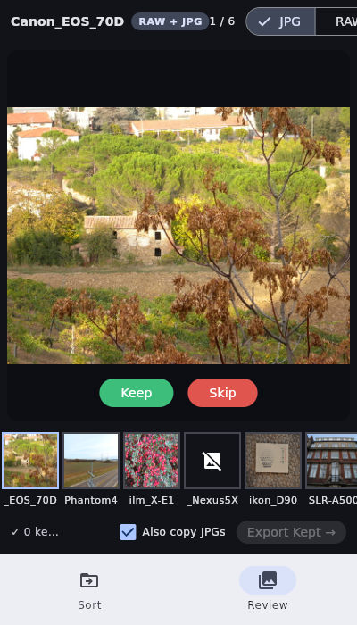

# Photo Sorter

A fast, modern photo utility for photographers — sort RAW + JPG files into tidy subfolders, then review and cull your shots before editing. One Flutter codebase, **runs on iOS, Android, macOS, Windows, and Linux**.

The RAW preview pipeline is pure Dart (no native dependencies): it extracts the embedded JPEG preview straight out of your RAW files — the same preview your camera writes — so browsing is instant even for 20MB+ files, on every platform.

---

## Screenshots

### Sort — organize files with one click


### Review — cull photos before editing




The layout adapts automatically: navigation rail + keyboard-driven culling on desktop, bottom navigation + swipe/tap culling on phones.

---

## Features

**Sort**
- Pick any folder of RAW/JPG files; optionally pick a separate output folder (or sort in-place)
- RAWs go to `RAW/`, JPGs go to `JPG/`, duplicates are skipped, other files left alone
- Moves when sorting in-place, copies to a separate output — with live progress and a results summary
- Supported RAW formats: ARW · CR2 · CR3 · NEF · RAF · ORF · DNG · RW2 · PEF · SRW

**Review**
- Dark, distraction-free loupe viewer with **pinch/scroll zoom**
- RAW+JPG pairs detected automatically by filename stem
- Toggle between the companion JPG and the RAW's embedded preview
- Filmstrip with color-coded flags: blue = current, green = keep, red (dimmed) = skip
- Keyboard-first on desktop, swipe + on-screen buttons on mobile
- Decisions auto-save to `cull_session.json` in the photo folder (compatible with the legacy Python app) — quit anytime, pick up where you left off
- Export kept RAWs (optionally with their JPGs) to a clean folder for Lightroom import

| Key | Action |
|-----|--------|
| `←` `→` | Previous / next photo |
| `↑` or `K` | **Keep** — auto-advances to next undecided |
| `↓` or `X` | **Skip** — auto-advances to next undecided |
| `U` | Unflag |
| `R` or `Tab` | Toggle JPG ↔ RAW preview |
| `Home` / `End` | First / last photo |

---

## Getting started

Requires [Flutter](https://docs.flutter.dev/get-started/install) (stable, ≥ 3.44).

```bash
cd app
flutter pub get
flutter run            # runs on the connected device / current desktop
```

Release builds:

```bash
flutter build linux      # Linux desktop
flutter build windows    # Windows
flutter build macos      # macOS
flutter build apk        # Android
flutter build ios        # iOS (requires Xcode + signing)
```

CI builds all five targets on every push — see `.github/workflows/ci.yml`.

### Mobile notes

- **iOS/Android folder access**: folder picking uses the system document picker. Folders that aren't real filesystem paths (e.g. cloud storage providers via Android SAF) can't be sorted in place; the app detects this and tells you.
- Review/cull is read-mostly and works well on mobile; the Sort feature shines on desktop where the OS gives full folder access.

---

## Architecture

```
app/
├── lib/
│   ├── core/                  # Pure Dart engine — no Flutter imports, fully unit-tested
│   │   ├── scanner.dart       #   find RAWs + pair companion JPGs by stem
│   │   ├── sorter.dart        #   move/copy with progress, duplicate + cross-volume handling
│   │   ├── cull_session.dart  #   cull_session.json persistence
│   │   ├── exporter.dart      #   copy kept files out
│   │   └── raw_preview/       #   embedded-JPEG extraction: TIFF/IFD parser,
│   │                          #   CR3 (ISO-BMFF) + RAF handling, validated JPEG scan fallback
│   ├── state/                 # Riverpod controllers (sort, cull, preview/thumbnail caches)
│   ├── ui/                    # Material 3 — adaptive shell, sort screen, dark review screen
│   └── services/              # platform file picking
└── test/                      # engine unit tests (incl. real RAW samples) + widget tests
```

The engine is tested against real camera files (Sony ARW, Canon CR2, Nikon NEF, DNG, Fuji RAF) — including padded-preview and no-preview edge cases.

---

## Legacy Python scripts

The original cross-platform Python implementation is kept for scripting use:

- `sort_photos.py` — CLI sorter (`python3 sort_photos.py /path/to/photos [output]`)
- `photo_sorter_app.py` — the previous customtkinter desktop app (`pip3 install customtkinter Pillow rawpy`)

Both read/write the same folder layout and `cull_session.json` format as the Flutter app.
